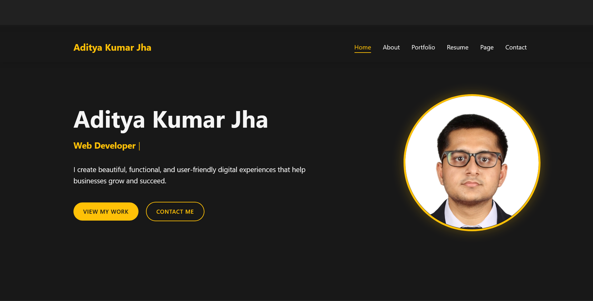
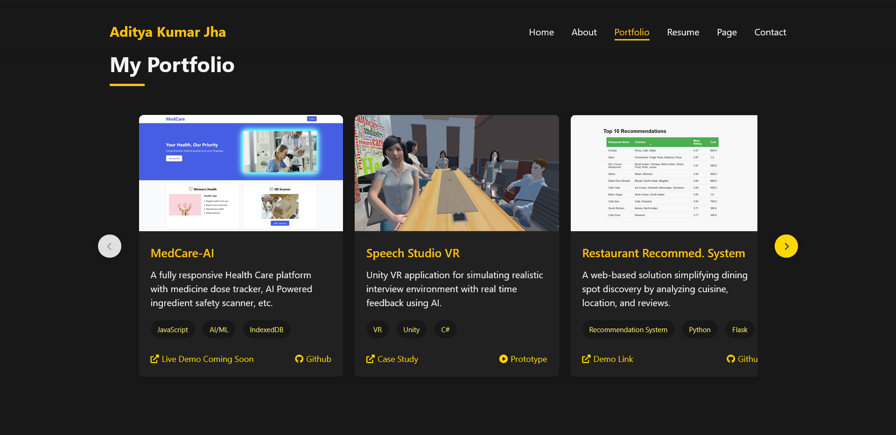

# 🚀 Aditya Kumar Jha — Portfolio Website

Personal portfolio website showcasing my projects, skills, and experience as a Computer Science graduate with expertise in VR development, AI/ML, web development, and IoT solutions.

## 🌐 Live Site

**[adityakumarjha.com.np](https://www.adityakumarjha.com.np)**

## 📌 Features

- 🖥️ Modern, responsive dark-themed design
- 📂 Project showcase with horizontal scroll carousel
- 📝 Blog / insights section
- 📞 Contact form (powered by Formspree)
- ⚡ Dynamic typing animation (Typed.js)
- 🔍 SEO-optimized with Open Graph & Twitter Card meta tags

## 🛠️ Tech Stack

| Layer | Technologies |
|---|---|
| **Frontend** | HTML5, CSS3, Vanilla JavaScript |
| **Libraries** | [Typed.js](https://github.com/mattboldt/typed.js/), Font Awesome |
| **Hosting** | GitHub Pages + Cloudflare |

## 📁 Project Structure

```
Portfolio/
├── index.html              ← Main page
├── 404.html                ← Custom error page
├── CNAME                   ← Custom domain config
├── robots.txt              ← Search engine directives
├── sitemap.xml             ← SEO sitemap
├── LICENSE                 ← Copyright notice
├── css/
│   └── styles.css          ← All styles
├── js/
│   └── main.js             ← All scripts
└── assets/
    ├── images/             ← Project & blog images
    └── favicon/            ← Favicons & web manifest
```

## 📖 Local Development

```bash
# Clone the repository
git clone https://github.com/AdityaKumarJha-1922/Portfolio.git
cd Portfolio

# Open with Live Server (VS Code) or any static file server
```

## 📷 Screenshots




## 📬 Contact

- 📧 **Email:** info.adityajha1@gmail.com
- 🔗 **LinkedIn:** [Aditya Kumar Jha](https://www.linkedin.com/in/aditya-kumar-jha-572149197/)
- 🐙 **GitHub:** [@AdityaKumarJha-1922](https://github.com/AdityaKumarJha-1922)

---

© 2026 Aditya Kumar Jha. All Rights Reserved.